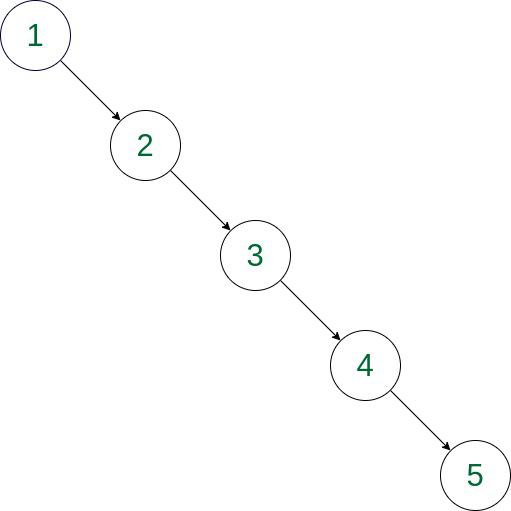

# Degenerate (Pathological) Binary Tree – Explanation & Mitigation

## ❓ Question

Describe what a degenerate (pathological) binary tree is, how it commonly arises from BST operations (e.g., sorted inserts), its impact on algorithmic complexity, and practical strategies to prevent or mitigate degenerate trees in production.

---

## ✅ Answer

### 1. What is a Degenerate Binary Tree?

A degenerate (pathological) binary tree is one where each parent has only one child, so the tree effectively becomes a linked list. It commonly arises in a plain Binary Search Tree (BST) when inputs are inserted in sorted (or reverse-sorted) order: each new key is always greater (or smaller) than previous, so it attaches as a single right- (or left-) child repeatedly.

Impact on complexity:

    Balanced BST expected costs: O(log n) for search/insert/delete.
    Degenerate tree costs degrade to O(n) for those operations because height becomes n.
    This increases latency, CPU, and can worsen memory/cache behavior.

Practical strategies to prevent/mitigate:

    Use self-balancing BSTs (AVL, Red–Black) which guarantee O(log n) height.
    Use randomized structures: treaps (random priorities), or randomize/shuffle inputs before bulk insert.
    Choose alternative data structures when appropriate: hash tables for average O(1) lookups, B-trees for disk-based workloads.
    Rebalance periodically: rebuild tree when skew detected (e.g., if height >> c·log n).
    Monitor and profile: detect increasing operation latencies and switch strategies.
    For concurrent systems, prefer well-tested concurrent balanced structures or databases that handle balancing.

Reasoning: preventing skew keeps height logarithmic, preserving algorithmic guarantees and predictable performance in production.

#### Example (Sorted Insert: 1 → 2 → 3 → 4 → 5)

---

 বাংলা

যদি BST-তে sorted data insert করা হয়, তাহলে সব node একদিকে চলে যায়  
→ ফলে tree skewed হয়ে যায়।

---

## 3. Impact on Complexity

### Balanced Tree:
- Height ≈ log(n)
- Operations:
  - Search: O(log n)
  - Insert: O(log n)
  - Delete: O(log n)

### Degenerate Tree:
- Height = n
- Operations:
  - Search: O(n)
  - Insert: O(n)
  - Delete: O(n)

---

### Why This is Bad

- ❌ Slower operations
- ❌ Higher CPU usage
- ❌ Increased latency
- ❌ Poor cache performance

---

Balanced tree হলে দ্রুত কাজ করে (O(log n))  
কিন্তু degenerate হলে সব অপারেশন slow হয়ে যায় (O(n))।

---

## 4. Practical Strategies to Prevent / Mitigate

### 4.1 Use Self-Balancing Trees

Examples:
- AVL Tree
- Red-Black Tree

✔ Guarantees height = O(log n)

---

Self-balancing tree নিজে নিজে balance রাখে, তাই performance stable থাকে।

---

### 4.2 Use Randomization (Treap)

- Assign random priority to nodes
- Maintains probabilistic balance

✔ Expected performance: O(log n)

---

Random priority দেওয়ার কারণে tree skew হওয়ার সম্ভাবনা কমে যায়।

---

### 4.3 Shuffle Input Before Insert

Instead of:
[1,2,3,4,5]

Use:
[3,1,5,2,4]

✔ Reduces skew risk

---

Insert করার আগে data shuffle করলে balanced হওয়ার chance বাড়ে।

---

### 4.4 Use Alternative Data Structures

| Use Case | Structure |
|----------|----------|
| Fast lookup | Hash Table |
| Large disk data | B-Tree |

---

সব ক্ষেত্রে BST ব্যবহার করা ঠিক না — প্রয়োজনে অন্য data structure ব্যবহার করা উচিত।

---

### 4.5 Periodic Rebalancing

- Detect skew (height >> log n)
- Rebuild tree

---

Tree বেশি skew হলে আবার rebuild করে balance করা যায়।

---

### 4.6 Monitoring & Profiling

- Track latency
- Detect degradation early

---

Performance monitor করলে সমস্যা আগেই ধরা যায়।

---

## 5. Key Insight

> Preventing skew keeps the tree height logarithmic, ensuring predictable and efficient performance in production systems.

---

 সারাংশ

Tree balanced থাকলে:
- দ্রুত কাজ করে
- scalable হয়
- production-এ reliable থাকে

---

## 6. Quick Comparison

| Type | Height | Performance |
|------|--------|------------|
| Balanced BST | log(n) | Fast |
| Degenerate BST | n | Slow |

---

## 7. Real-World Relevance

Used in:
- Databases (indexes)
- Compilers
- Memory systems
- Search engines

---

Real system-এ balanced tree খুব গুরুত্বপূর্ণ কারণ large data handle করতে হয়।

---

## ✔ Final Takeaway

- Plain BST is **unsafe in production**
- Always prefer:
  - Self-balancing trees OR
  - Randomized structures OR
  - Alternative data structures

